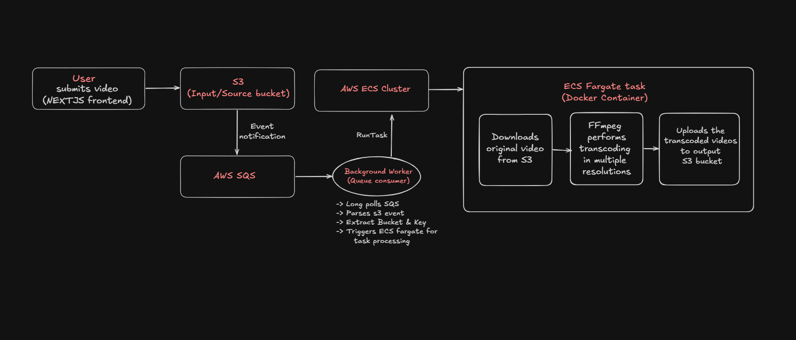

# Video Transcoding Pipeline

A cloud-native video processing pipeline that automatically transcodes uploaded videos into multiple resolutions using **FFmpeg**, **AWS ECS Fargate**, **Amazon S3**, and **Amazon SQS**. 

---

## 1) Tech Stack

| Layer | Technologies |
| :--- | :--- |
| **Backend & Event Processing** | Node.js, TypeScript, AWS SDK |
| **Video Processing** | FFmpeg, fluent-ffmpeg |
| **Cloud Infrastructure** | AWS ECS Fargate, Amazon ECR, Amazon S3, Docker |
| **Frontend** | Next.js, Tailwind, shadcn/ui |
---

## 2) 🏗️ Architecture & System Design

### System Overview Diagram



### Core System Components

**Video Upload:** Users upload an `.mp4` video through the Next.js frontend, which stores the original file in an Amazon S3 input bucket.

**Event Notification:** Amazon S3 automatically publishes an event notification to an Amazon SQS queue whenever a new video is uploaded.

**Queue Consumer:** A Node.js background worker continuously long-polls the SQS queue, validates incoming S3 events, and extracts the uploaded object's metadata.

**Task Orchestration:** For each valid upload event, the worker invokes the AWS ECS `RunTask` API to launch an isolated Fargate task using a preconfigured Docker image.

**Video Transcoding:** The Fargate task downloads the source video from S3, generates multiple output resolutions (360p, 480p, and 720p) using FFmpeg, and uploads the transcoded videos back to Amazon S3.

---

## 3) 📂 Project Structure

```
video-transcoding-pipeline/
├── container/              # Transcoding worker (Runs in ECS Fargate)
│   ├── Dockerfile
│   ├── index.js            # Ffmpeg processing logic
│   ├── package.json
│   └── package-lock.json
├── frontend/               # Next.js Application (Web Portal)
├── src/                    # SQS Queue Consumer Daemon
│   └── index.ts            # Listens to SQS, invokes ECS Tasks
├── package.json            # Root configuration
├── pnpm-lock.yaml
└── tsconfig.json
```

---

## 4) Getting Started

### Prerequisites

Before running the project, ensure you have the following installed:
* Node.js (v18 or later)
* Docker
* AWS CLI
* An AWS account with:
  * S3, SQS, ECS (Fargate), ECR
  * VPC, Subnets, and Security Group
  * IAM credentials with access to S3, SQS, ECS, and ECR

### Clone the Repository

```bash
git clone https://github.com/samarth-devx/video-transcoding-pipeline.git
cd video-transcoding-pipeline
```

### Install Dependencies

Install dependencies for the queue consumer:

```bash
pnpm install
```

Install dependencies for the transcoding container:

```bash
cd container
npm install
cd ..
```

### Configure Environment Variables

Create a `.env` file in the project root for the queue consumer.

```env
AWS_REGION=
AWS_ACCESS_KEY_ID=
AWS_SECRET_ACCESS_KEY=

QUEUE_URL=

TASK_ARN=
CLUSTER_ARN=

SECURITY_GROUP=
SUBNET1=
SUBNET2=
SUBNET3=
```

Create a `.env` file inside the container/ directory for the transcoding container. The transcoding container receives the following environment variables from the ECS Task at runtime:

```env
AWS_REGION=

AWS_ACCESS_KEY=
AWS_SECRET_KEY=

BUCKET_NAME=
KEY=
```

> **Note:** `BUCKET_NAME` and `KEY` are automatically injected into the container by the queue consumer when launching an ECS Fargate task.


### Build and Push the Transcoding Container

```bash
cd container

# Authenticate Docker with Amazon ECR
aws ecr get-login-password --region <aws-region> | docker login --username AWS --password-stdin <your-ecr-uri>

# Build, tag, and push the transcoding container
docker build -t video-transcoder .
docker tag video-transcoder:latest <your-ecr-uri>:latest
docker push <your-ecr-uri>:latest
```

Update your ECS Task Definition to use the latest image before starting the queue consumer.

### Start the Application

Start the background queue consumer (at the root directory):

```bash
pnpm dev
```
In a separate terminal, start the Next.js frontend:

```bash
cd frontend
npm run dev
```


### Upload a Video

Open the frontend in your browser and upload an `.mp4` video. The processing pipeline executes automatically:

1. The frontend uploads the video to the Amazon S3 input bucket.
2. Amazon S3 publishes an event notification to Amazon SQS.
3. The queue consumer receives the upload event.
4. The worker invokes the ECS `RunTask` API to launch an isolated AWS ECS Fargate task.
5. The transcoding container downloads the source video from S3.
6. FFmpeg generates 360p, 480p, and 720p renditions.
7. The processed videos are uploaded back to Amazon S3.


### Output

The transcoded videos are stored in Amazon S3 using the following directory structure:

```text
video-id/
├── video-360p.mp4
├── video-480p.mp4
└── video-720p.mp4
```

---
## 5) Features

* Event-driven video processing
* Automatic transcoding on video upload
* Parallel generation of multiple resolutions
* Containerized FFmpeg workers using Docker
* Serverless execution with AWS ECS Fargate
* Asynchronous processing using Amazon SQS
* Object storage with Amazon S3
* Easily extensible for additional resolutions and formats

---

## 6) Future Improvements

* Adaptive bitrate streaming (HLS/DASH)
* Retry and dead-letter queue support
* Support for 1080p and 4K transcoding
* CloudWatch monitoring and logging

---
